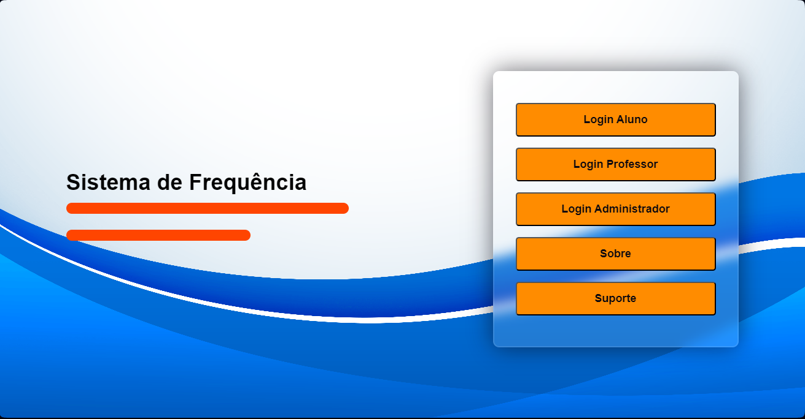
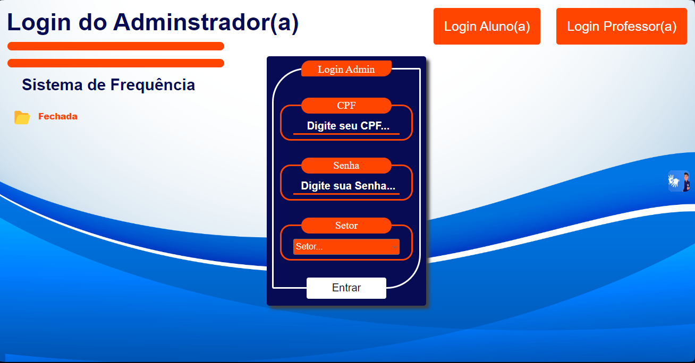
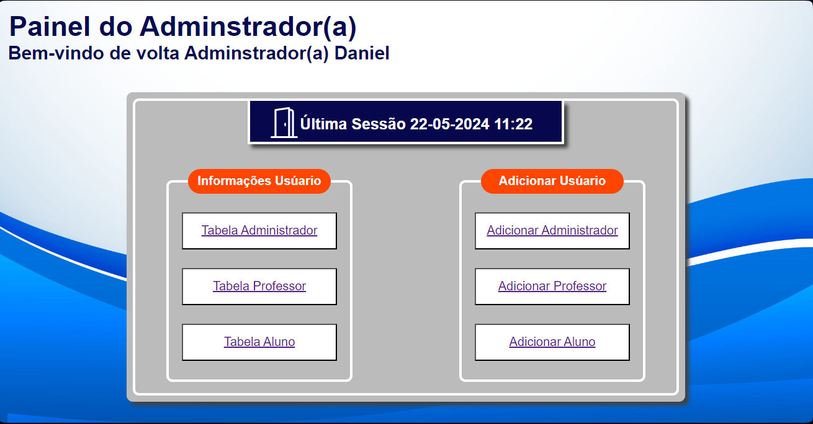
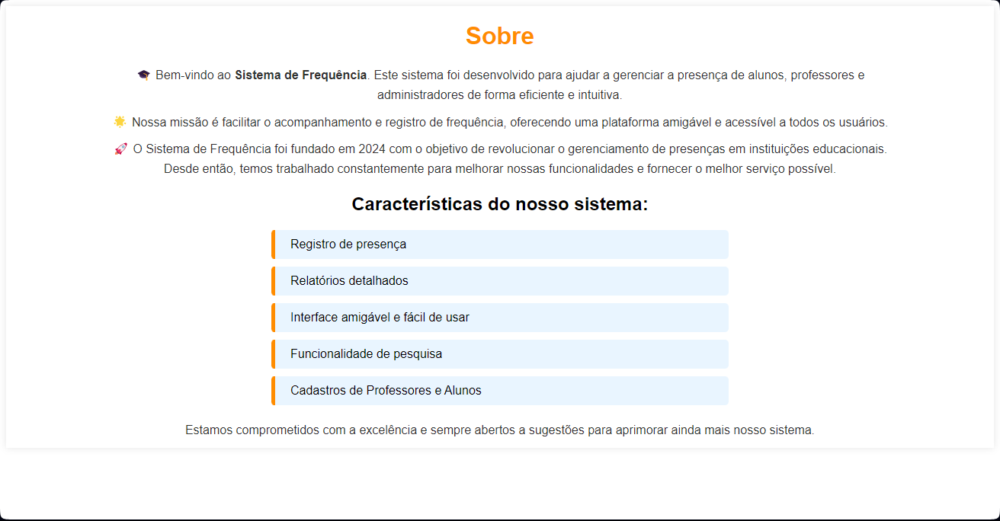
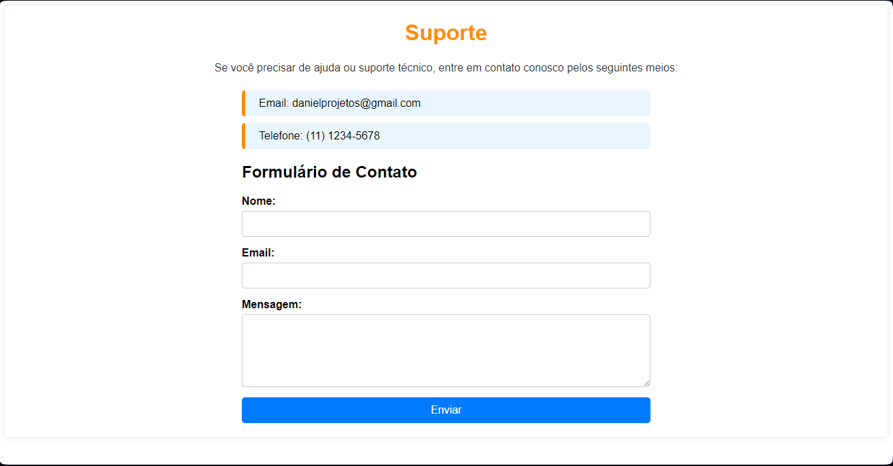

# Sistema de Frequência




## Descrição

O **Sistema de Frequência** é uma plataforma desenvolvida para gerenciar a presença de alunos, professores e administradores de maneira eficiente e intuitiva. Com ele, você pode registrar, acompanhar e gerar relatórios de frequência facilmente.

## Funcionalidades

- Registro de presença 
- Relatórios de Alunos e Professores
- Interface amigável e fácil de usar
- Funcionalidade de pesquisa
- Cadastro de Alunos , Professores, Administradores
- Marca presença por aluno

## Pré-requisitos

> [!IMPORTANT]  Antes de começar, você precisará ter as seguintes ferramentas instaladas em sua máquina:

- [Git](https://git-scm.com)
- [PHP](https://www.php.net/)
- [MySQL](https://www.mysql.com/)
- Um servidor web como [XAMPP](https://www.apachefriends.org/index.html) ou [WAMP](http://www.wampserver.com/en/)

## Instalação

1. Clone o repositório para sua máquina local:

    ```bash
    https://github.com/dvizioon/SISTEMA-FRENQUENCIA.git
    ```

2. Navegue até o diretório do projeto:

    ```bash
    cd SISTEMA-FRENQUENCIA
    ```

> [!CAUTION]
> se você estiver usando um servidor embutido lembre-se de configurar o caminho das ext no php.ini/ para reconhecer as DLLS.

3. Configure seu servidor web para apontar para o diretório do projeto.

4. Importe o banco de dados MySQL:

    - Abra o phpMyAdmin / ou outro SGBD.
    - Importe o arquivo `script.sql` localizado no diretório `packages`.


# Configuração do script.sql 📤
> [!WARNING]  
> Entre no pasta `packages` e mude as configurações do banco hein `script.sql` depois importe ao SGBD.
```sql

-- Opcional você pode Personalizar a Criação com
-- outro nome de banco,mais lembre-se de trocar
-- no arquivo de conexão do php_mysqli e pdo_driver

create database sistema_frequencia;
use sistema_frequencia;

...

INSERT INTO Administrador(Nome_adm, Cpf_adm,senha_adm, setor_adm, sesao_adm, Ativo)  VALUES('admin','00011100011','12345678','administracao','Inativo',CURRENT_TIMESTAMP());

```

# Configuração Manual de Pesquisas 📦⚠️

> [!WARNING]  
> Entre no Arquivo `config.php` e mude o host o banco o usuario é senha para que o Sistema em Geral Funcione.
```php

define('Host','seu_host');
define('User', 'seu_user');
define('Pass','seu_pass');
define('Name','seu_banco');

$conn = mysqli_connect(Host,User,Pass,Name) or dir('Not_Connect');
    

```


> [!WARNING]  
> Entre no Arquivo `_consulta_aluno.php` e mude o host o banco o usuario é senha para que a consulta de dados funcione.
```php
$nome= "%".trim($_GET['aluno'])."%";
$db = new PDO('mysql:host=seu_host;dbname=seu_banco', 'seu_usuario','sua_senha');
$cns = $db->prepare('SELECT * FROM `frequencia` WHERE `Nome_aluno` LIKE :Nome_aluno');
$cns->bindParam(':Nome_aluno',$nome,PDO::PARAM_STR);
$cns->execute();
$result = $cns->fetchAll(PDO::FETCH_ASSOC);
```

> [!WARNING]  
> Entre no Arquivo `consulta_do_user_aluno.php` e mude o host o banco o usuario é senha para que a consulta de dados funcione.

```php
$nome= "%".trim($_GET['aluno'])."%";
$db = new PDO('mysql:host=seu_host;dbname=seu_banco', 'seu_usuario','sua_senha');
$cns = $db->prepare('SELECT * FROM `frequencia` WHERE `Nome_aluno` LIKE :Nome_aluno');
$cns->bindParam(':Nome_aluno',$nome,PDO::PARAM_STR);
$cns->execute();
$result = $cns->fetchAll(PDO::FETCH_ASSOC);
```


## Uso

Abra seu navegador e vá para `http://localhost/sistema-de-frequencia` para ver o sistema em ação.

### Páginas dos Logins
> Login Admin



### Página Adm



### Página de Sobre



### Página de Suporte



## Estrutura do Projeto

```sh

SISTEMA-FRENQUENCIA/
├── css/
│ └── style.css
│ └── init.css
├── img/
│ └── fundo.png
├── js/
│ └── node.js
├── packages/
│ └── sistema_frequencia.sql
├── _login_aluno.php
├── _login_prof.php
├── _loogin_adm.php
├── ...
├── LICENSE
└── README.md

```


## Licença

Distribuído sob a licença MIT. Veja `LICENSE` para mais informações.
